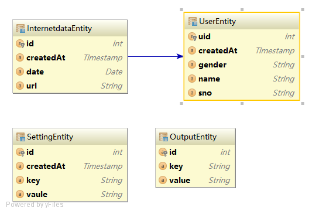
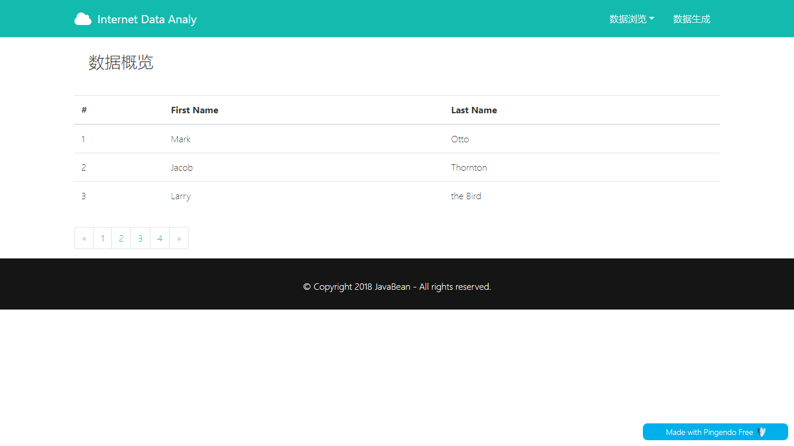

# InternetDataAnaly

## 要求

字段： 
姓名[可随机]、学号[可随机]、上网时间[可指定区间随机]、网站[可随机]、性别[可随机]

模块： 
网站前台：设置产生数据规则、展示页面 
单元测试模块：编写测试case验证数据分析正确性 
网站后台：根据前台数据规则产生数据 
HADOOP服务端：分析数据并将结果上传 
后台脚本：完成数据接收、上传HDFS等 
数据库段：配置各个节点IP等配置信息、各个随机区间内容。

展示要求： 
1、访问最多的网站     N 
2、男生访问最多的网站. N 
3、女生访问最多的网站 N 
4、指定时间区间内上网次数最多的学生姓名 2  
5、指定时间区间内上网次数最多的男生学生姓名 2 
6、指定时间区间内上网次数最多的女生学生姓名2 
7、以10分钟为区间，上网次数最多的时间区间 N 
8、指定时间段，查看上网次数最多的学生学号 2 
9、同时[5s以内]同时上同一个网站的男生列表 1 
10、同时[5s以内]同时上同一个网站的女生列表 1

(top10或可以翻页查看全部或饼状图,指定时间直接系统设置[支持设置3个时间段])

## 后端数据库设计
### 数据库关系

### 数据库实现
    +----------------------------------------------------------------+
    |                            user                                |
    +----------+-------------+------+-----+---------+----------------+
    | Field    | Type        | Null | Key | Default | Extra          |
    +----------+-------------+------+-----+---------+----------------+
    | uid      | int         | NO   | PRI |         | auto_increment |
    | sno      | varchar(20) | NO   |     |         |                |    
    | name     | varchar(50) | NO   |     |         |                |
    | gender   | varchar(5)  | NO   |     |         |                |
    |created_at| timestamp   | NO   |     |         |                |
    +----------+-------------+------+-----+---------+----------------+
    
    CREATE TABLE user (
      uid int(11) NOT NULL AUTO_INCREMENT,
      sno varchar(20) NOT NULL,
      name varchar(20) NOT NULL,
      gender varchar(5) NOT NULL,
      created_at timestamp NOT NULL DEFAULT CURRENT_TIMESTAMP ON UPDATE CURRENT_TIMESTAMP,
      PRIMARY KEY (uid)
    ) ENGINE=InnoDB DEFAULT CHARSET=utf8
    
    +----------------------------------------------------------------+
    |                        internetdata                            |
    +----------+-------------+------+-----+---------+----------------+
    | Field    | Type        | Null | Key | Default | Extra          |
    +----------+-------------+------+-----+---------+----------------+
    | id       |int          | NO   | PRI |         | auto_increment |
    | uid      |int          | NO   |     |         |                |
    | url      |varchar(1000)| NO   |     |         |                |    
    | date     |datetime     | NO   |     |         |                | -- yyyy-mm-dd HH:mm:ss
    |created_at|timestamp    | No   |     |         |                |
    +----------+-------------+------+-----+---------+----------------+
    
    CREATE TABLE internetdata (
      id int(11) NOT NULL AUTO_INCREMENT,
      uid int(11) NOT NULL,
      url varchar(1000) NOT NULL,
      date datetime NOT NULL,
      created_at timestamp NOT NULL DEFAULT CURRENT_TIMESTAMP ON UPDATE CURRENT_TIMESTAMP,
      PRIMARY KEY (id),
      KEY fk_001 (uid),
      CONSTRAINT fk_001 FOREIGN KEY (uid) REFERENCES user (uid)
    ) ENGINE=InnoDB DEFAULT CHARSET=utf8
    
    +----------------------------------------------------------------+
    |                        setting                                 |
    +----------+-------------+------+-----+---------+----------------+
    | Field    | Type        | Null | Key | Default | Extra          |
    +----------+-------------+------+-----+---------+----------------+
    | id       |int          | NO   | PRI |         | auto_increment |
    | key      |varchar(255) | NO   |     |         |                |
    | value    |varchar(255) | NO   |     |         |                |
    |created_at|timestamp    | No   |     |         |                |
    +----------+-------------+------+-----+---------+----------------+
    
    CREATE TABLE setting (
      id int(11) NOT NULL AUTO_INCREMENT,
      key varchar(255) NOT NULL,
      vaule varchar(255) NOT NULL,
      created_at timestamp NOT NULL DEFAULT CURRENT_TIMESTAMP ON UPDATE CURRENT_TIMESTAMP,
      PRIMARY KEY (id)
    ) ENGINE=InnoDB DEFAULT CHARSET=utf8
    
    +----------------------------------------------------------------+
    |                        output                                  |
    +----------+-------------+------+-----+---------+----------------+
    | Field    | Type        | Null | Key | Default | Extra          |
    +----------+-------------+------+-----+---------+----------------+
    | id       |int          | NO   | PRI |         | auto_increment |
    | key      |varchar(255) | NO   |     |         |                |
    | value    |varchar(255) | NO   |     |         |                |
    |created_at|timestamp    | NO   |     |         |                |
    +----------+-------------+------+-----+---------+----------------+
    
    CREATE TABLE output (
      id int(11) NOT NULL,
      key varchar(255) NOT NULL DEFAULT '0',
      value varchar(255) NOT NULL DEFAULT '0',
      PRIMARY KEY (id)
    ) ENGINE=InnoDB DEFAULT CHARSET=utf8
    
    

## 前端设计
### 设计总括
1. 随机数据产生页面
    1. 随机数据产生配置文件
    2. 随机数据产生的结果（以配置文件的方式呈现）
2. 数据浏览页面
    1. 浏览产生的随机数据
    2. 根据用户自定义字段浏览
3. 计算结果并展示
    1. 数据汇总
    2. 根据用户要求进行计算
### 详细设计
+ 首页
    
    
+ 随机数据产生页面
    

## 数据计算
### 设计思路
